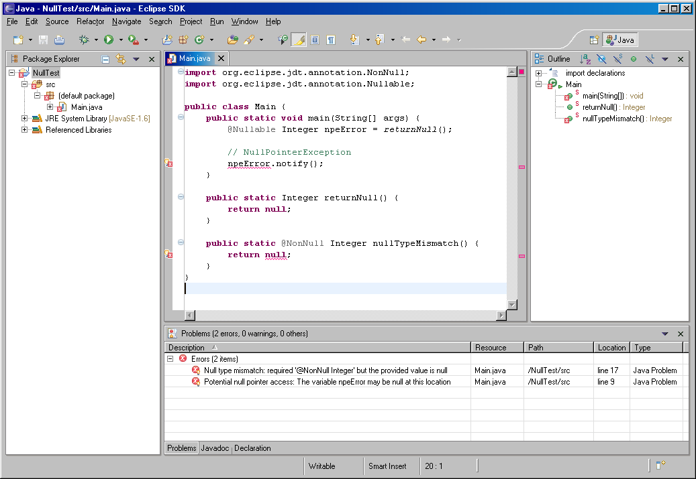
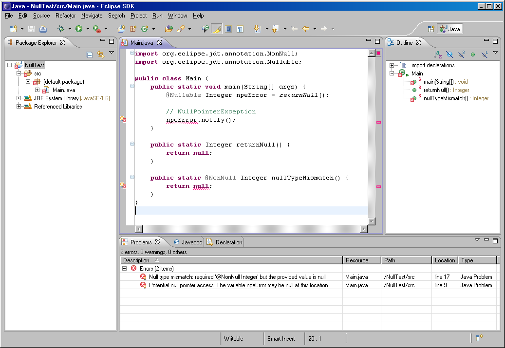
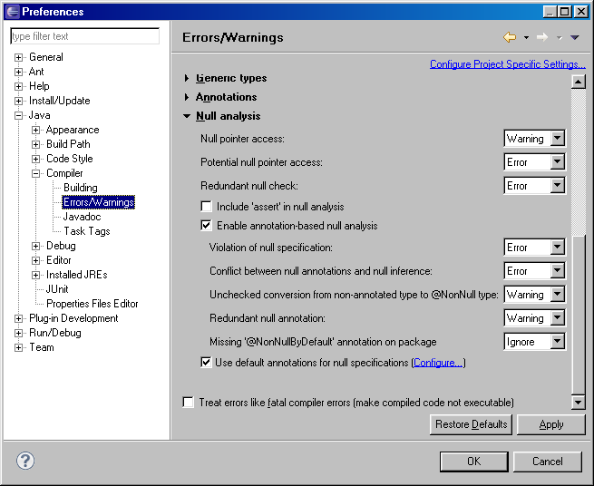

# 3.5.2-jdt-null-analysis

This is a backport of Eclipse JDT Core Batch Compiler (ECJ) 3.7.2 and supporting `org.eclipse.jdt.core` and `org.eclipse.jdt.ui` plugin code from Eclipse 4.2.1. This is a proof of concept that targeted the earliest release of ECJ to support null analysis and the first release of Eclipse to coincide with this version of ECJ to maximize code compatibility. The earliest releases were chosen to make backporting to such an old version of Eclipse easier. Support for newer versions of ECJ and Eclipse UI compiler options properties dialog should be possible.

The purpose of this backport is to add support for JDT null analysis to the last release of Eclipse which could run on Windows 98. Now you can enjoy programming on your vintage computer with your vintage IDE, targeting a vintage JVM with the luxury of full null analysis for writing robust and bug-free code.

Additional resources for compilation:

https://archive.eclipse.org/eclipse/downloads/drops/R-3.5.2-201002111343/

https://archive.eclipse.org/eclipse/downloads/drops4/R-4.2.1-201209141800/

https://mvnrepository.com/artifact/org.eclipse.jdt.core.compiler/ecj

I was only able build individual plugins and not the complete SDK release. The build tools and instructions for this version appear to be broken, and I don't know what's wrong with it. I welcome anyone who would like to try and figure it out how to get it working.

Original build instructions can be found here:

https://web.archive.org/web/20110915013425/http://wiki.eclipse.org/Platform-releng-sourcebuild35

The bug which is preventing a full rebuild seems to be related to this:

https://bugs.eclipse.org/bugs/show_bug.cgi?id=319460

To build from source, load the projects into your Eclipse IDE and build, then export as a jar. I don't know why the manifest files don't generate properly, but it may be a consequence of not creating the jar file using the platform build script. To work around this issue, use the manifest from the original release instead.

## Screenshots

